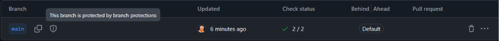
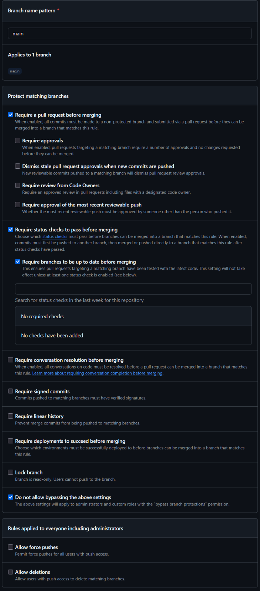

# Currículo Profissional - Luiz Henrique Schecheli Bussolo

Projeto desenvolvido para a disciplina DS881, aplicando conceitos de conteinerização, automação de pipeline CI/CD e governança de código.

## 🌐 Link da Aplicação
https://luiz-bussolo.github.io/ds881-curriculo-GRR20211637/

## 🚀 Como rodar o projeto localmente (Docker)

Este projeto utiliza o SSG Astro e está conteinerizado para facilitar o desenvolvimento sem a necessidade de instalar o Node.js no sistema hospedeiro.

1. Certifique-se de ter o Docker e o Docker Compose instalados.
2. Clone este repositório.
3. Na raiz do projeto, execute o comando:
   ```bash
   docker-compose up --build
   ```
4. Acesse o servidor de desenvolvimento em: `http://localhost:8080`

## 🛡️ Governança e Branch Protection
O projeto segue o fluxo de Pull Requests e Conventional Commits. A branch `main` está protegida contra pushes diretos e exige a aprovação com sucesso no pipeline de CI (Linter e Build automatizados via GitHub Actions) antes de qualquer integração.




*Nota: Print comprovando o bloqueio de commits diretos na main e a exigência do status check.*